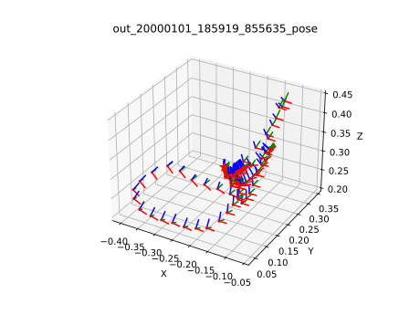

# Introduction to AR/VR (2017 Fall)
* 한림대학교 AR/VR의이해 (717007) 과목 수업 보조자료 공간입니다.

## 3D visualization
### 01-visualization3d

### 02-visualization-simple

### 03-visualization_with_rotation
Axis 그리기  

## Hello VR

## Hello Unity

